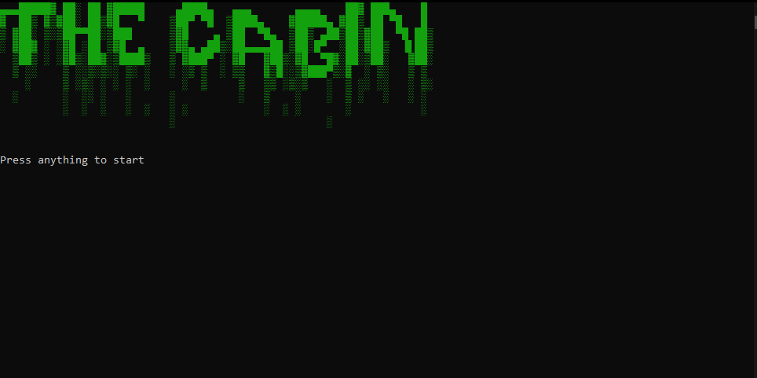

## Portfolio

---

### Projects 

 [Adventure Game - The Cabin](/sample_page)

Description: This project is an  adventure game set in a mysterious cabin you find yourself in. Players navigate through different scenarios, solving puzzles and making choices that impact the outcome.

---
 [Dysteria](/pdf/sample_presentation.pdf)

Description: Dysteria is a short but sweet game I made whilst attempting to learn WPF games! You travel through different locations in the lands of Dysteria and find quests to occupy yourself. The end goal is to succesfully acquire the Gold Purse in "Chigo"
---

---

### Category Name 2

- [Adventure Game - The Cabin](http://example.com/)
- [Dysteria](http://example.com/)

---

---

Page template forked from <a href="https://github.com/evanca/quick-portfolio">evanca</a>

<!-- Remove above link if you don't want to attibute -->
